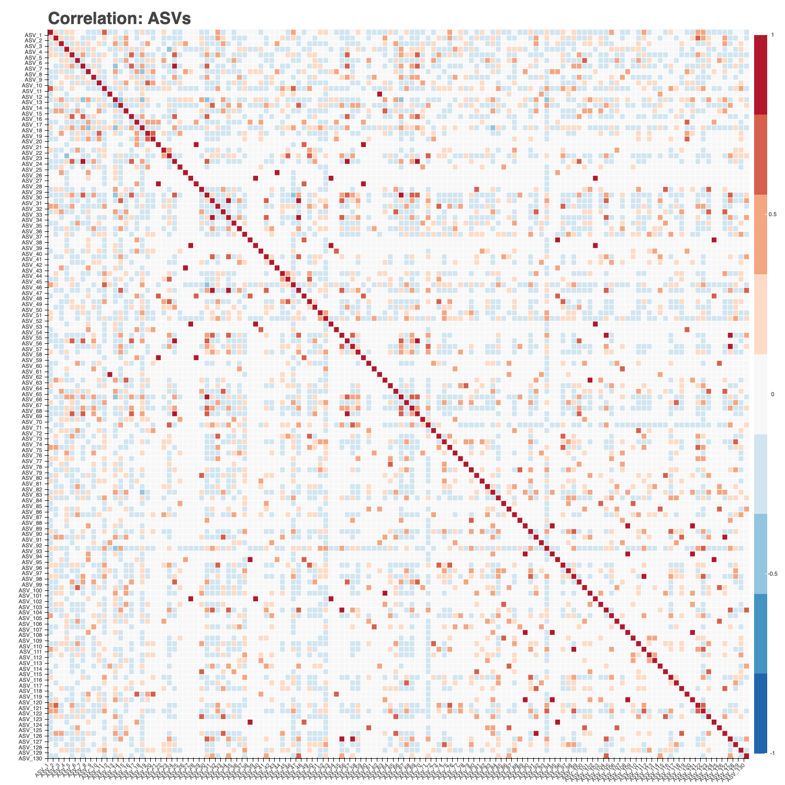
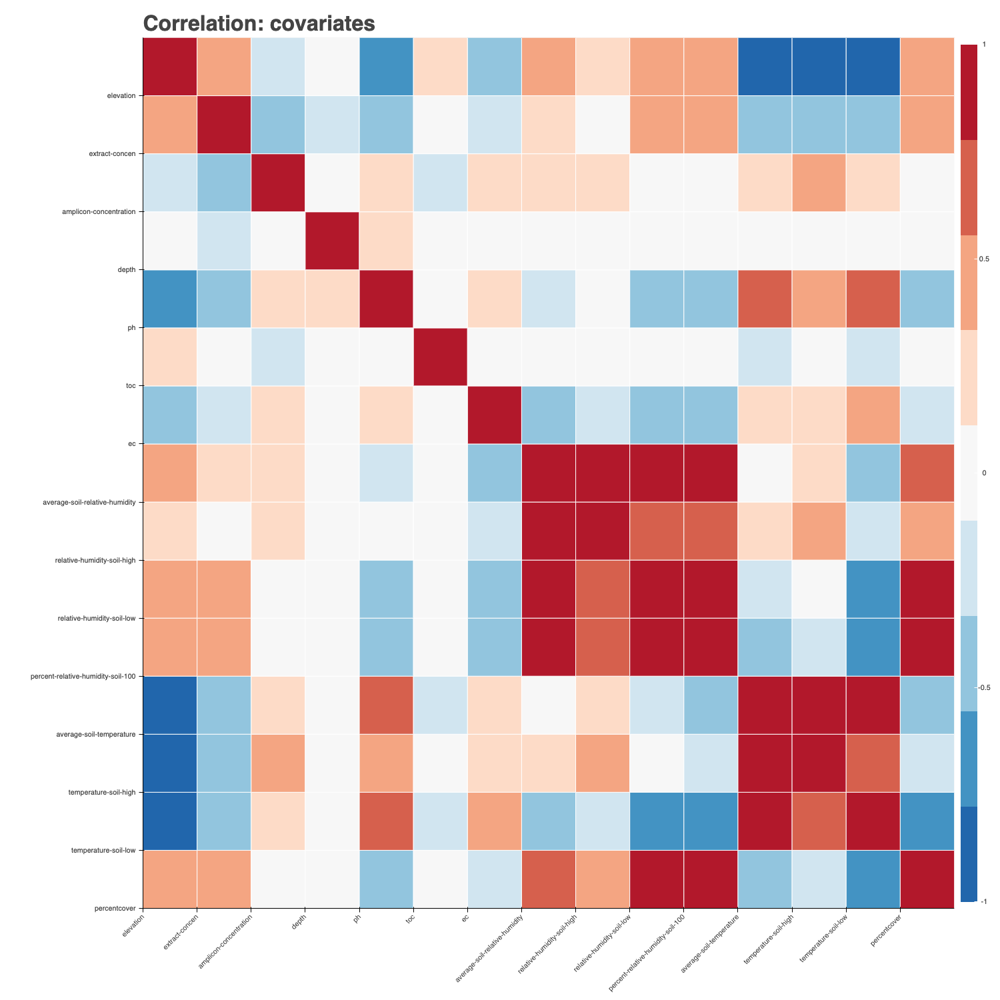
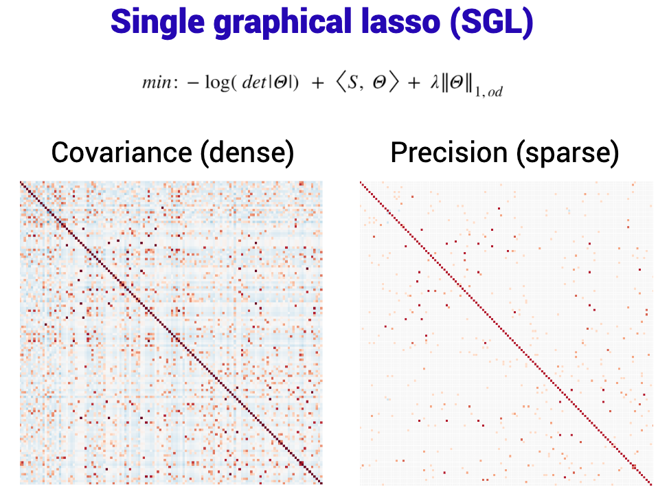
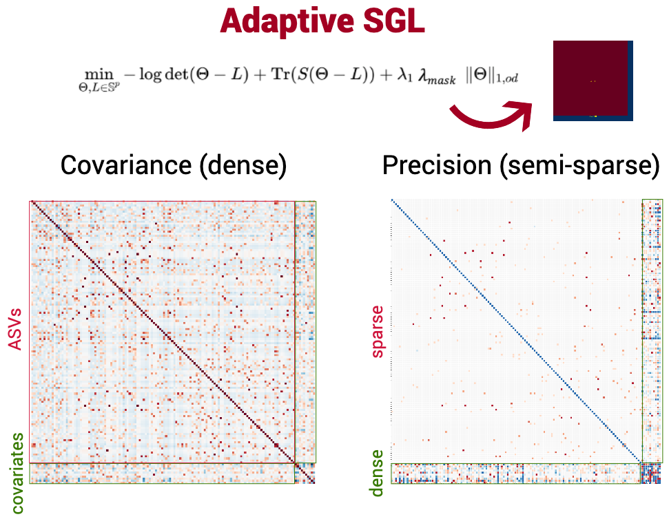
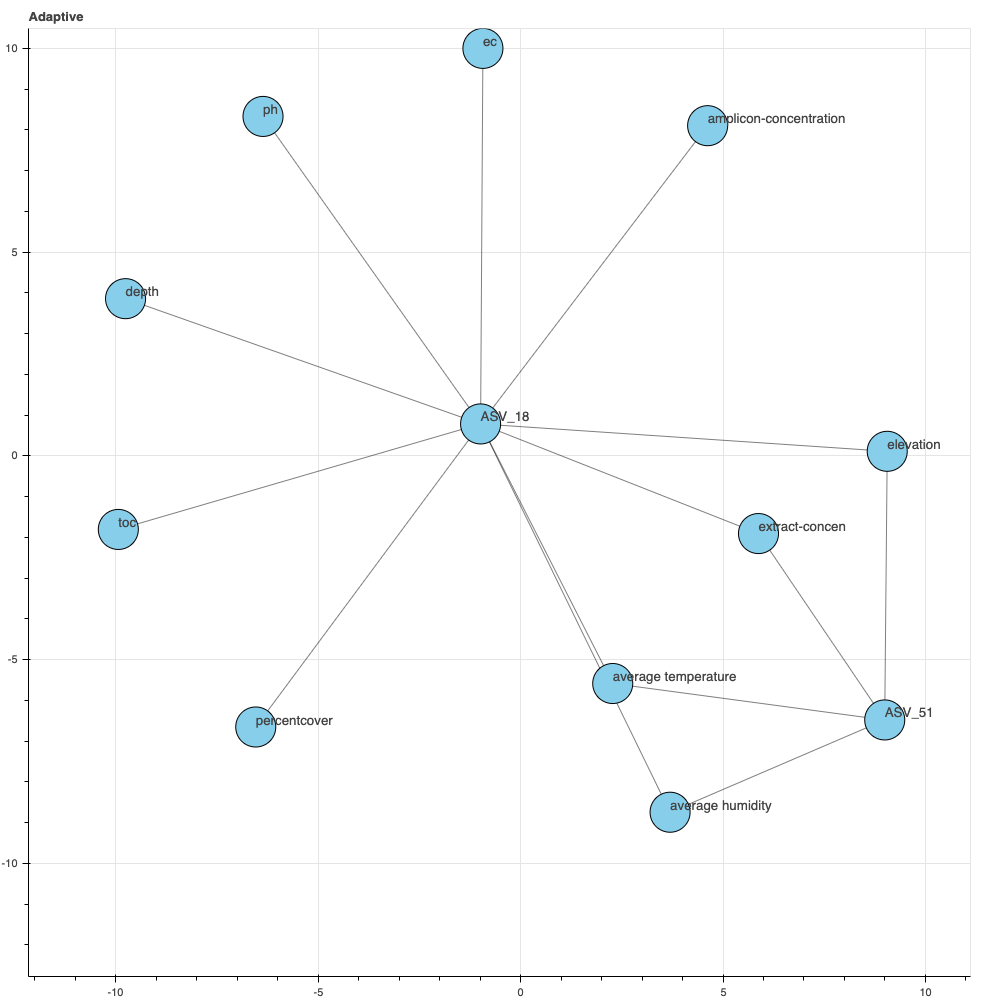
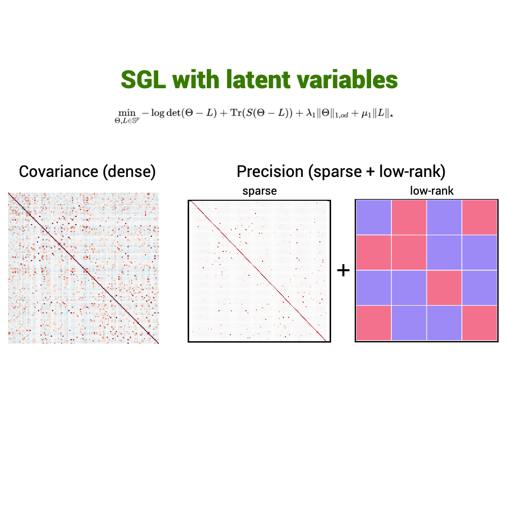
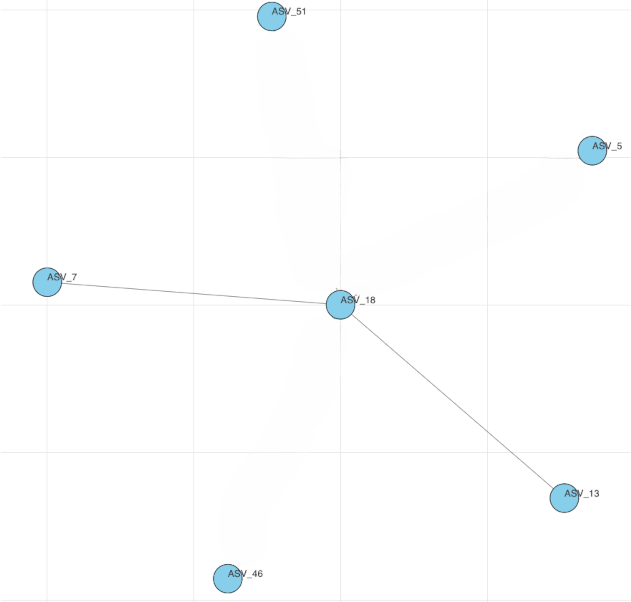

# q2-gglasso

This is a QIIME 2 plugin which contains algorithms for solving General Graphical Lasso (GGLasso) problems, including single, multiple, as well as latent 

Graphical Lasso problems.  

[Docs](https://gglasso.readthedocs.io/en/latest/) | [Examples](https://gglasso.readthedocs.io/en/latest/auto_examples/index.html)

For details on QIIME 2, see https://qiime2.org.

# Installation

# Example of Atacama soil microbiome analysis

Welcome to this tutorial on using QIIME 2 for analyzing soil samples from the Atacama Desert in 
northern Chile. This tutorial assumes that you have already installed QIIME 2, but if you 
haven't, you can follow the instructions from the [docs](https://docs.qiime2.org/2022.11/install/).

The Atacama Desert is known to be one of the most arid locations on Earth, with some areas receiving 
less than a millimeter of rain per decade. Despite such extreme conditions, the soil in the Atacama Desert 
is known to harbor a variety of microbial life. In this tutorial, we will explore how to use 
graphical models for analyzing microbial compositions in soil samples from the Atacama Desert.

Specifically, we will demonstrate the application of Single graphical lasso (SGL), adaptive 
SGL, and SGL + low-rank, to illustrate how covariates are related to microbial compositions.

Let's get started!

## Compositional data

In the following tutorial we will work with 130 ASVs written into count table of the following 
format:

|           | ASV 1     | ASV 2     | ASV 3     | ...       | ASV 130   |
|-----------|-----------|-----------|-----------|-----------|-----------|
| sample 1  | -0.167770 | -0.167770 | -0.167770 | ...       | -0.167770 |
| sample 2  | -0.436407 | -0.436407 | -0.436407 | ...       | -0.436407 |
| sample 3  | -0.229753 | 1.967471  | -0.229753 | ...       | -0.229753 |
| sample 4  | -0.424645 | 4.097143  | 3.264234  | ...       | -0.424645 |
| ...       | ...       | ...       | ...       | ...       | -0.353991 |
| sample 53 | -0.384811 | 4.069537  | 3.443831  | -0.384811 | -0.384811 |  

Please note that preprocessing steps, such as the [center log-ratio transformation](https://en.wikipedia.org/wiki/Compositional_data#:~:text=in%20the%20simplex.-,Center%20logratio%20transform,-%5Bedit%5D) 
of the count table and [scaling](https://en.wikipedia.org/wiki/Feature_scaling) metadata, have 
been omitted from this tutorial, but you can find these steps in the documentation linked [here](https://github.com/Vlasovets/atacama-soil-microbiome-tutorial/blob/main/python/tutorial.ipynb).

Figure 1. Correlation between ASVs in Atacama soil microbiome.

## Metadata
This section presents a description and basic statistical analysis of the covariates 
under investigation. For more comprehensive information about 
the research, readers are referred to the original [paper](https://www.frontiersin.org/articles/10.3389/fmicb.2021.794743/full).

| feature                            | mean  | std     | min  | max   | description (units)                                |  
|------------------------------------|-------|---------|------|-------|----------------------------------------------------|
| elevation                          | 2825  | 1014.23 | 895  | 4697  | height above sea level (m)                         |
| extract-concen                     | 2.92  | 5.96    | 0.01 | 33.49 | amount of DNA before PCR  (µg/ml)              |
| amplicon-concentration             | 9.54  | 6.81    | 0.12 | 19.2  | amount of DNA after PCR (µg/ml)                    |
| depth                              | 2     | 0.46    | 1    | 3     | level of sampling A/B/C (0–60/60–220/220–340 cm)   |
| ph                                 | 7.05  | 2.53    | 0    | 9.36  | potential of hydrogen (log)                        |
| toc                                | 693.8 | 1958.49 | 0    | 16449 | total organic carbon (μg/g)                        |
| ec                                 | 0.72  | 1.26    | 0    | 6.08  | electric conductivity (S/m in SI)                  |
| percentcover                       | 1.82  | 3.05  | 0     | 8.8   | vegetation coverage (% per $m^2$)                  |
| average-soil-relative-humidity     | 63.27 | 33.54   | 0    | 100   | average soil humidity  (%)                         |
| relative-humidity-soil-high        | 78.51 | 32.09   | 0    | 100   | soil humidity at the top of a sample (%)           |
| relative-humidity-soil-low         | 43.62 | 32.58 | 0     | 100   | soil humidity at the bottom of a sample (%)        |
| percent-relative-humidity-soil-100 | 37.86 | 39.45 | 0     | 100   | relative soil humidity across all depth levels (%) |
| average-soil-temperature           | 15.72 | 5.8   | 0     | 23.61 | average soil temperature (t°)                      |
| temperature-soil-high              | 23.61 | 6.82  | 0     | 35.21 | soil temperature at the top of a sample (t°)       |
| temperature-soil-low               | 7.24  | 5.96  | -2.57 | 18.33 | soil temperature at the bottom of a sample (t°)    |

Figure 2 illustrates the correlation between the covariates, it is clear that some of them are 
highly correlated and thus can be disregarded.
For instance, in the subsequent analysis of humidity and temperature, their average values shall suffice for our purposes.

Figure 2. Correlation between Atacama covariates.

## SGL

Figure 3. Single graphical lasso (SGL) solution.

Let us examine the discovered connections among ASVs at Figure 4. By definition of inverse 
covariance, the relationship between ASV 18, ASV 51, ASV 46, ASV 13, ASV 7, and ASV 5 is 
conditionally independent, implying that these relationships do not affect one another. 
Nevertheless, in reality, we are aware that the microbial compositions are frequently influenced 
by the environment. Therefore, we should contemplate the possibility of the existence of additional covariates and their potential impact on these associations. Furthermore, it is worth investigating whether these associations will be altered or remain unchanged due to the introduction of new covariates.

Figure 4. Bacterial associations in SGL solution.

## Adaptive SGL

Figure 5. Adaptive SGL solution.

Let us now incorporate information regarding the covariates in our model and evaluate the correlation between ASVs and various selected covariates such as temperature, humidity, pH, and others. As some of these covariates have a profound effect on microbial compositions, we will utilize an adaptive SGL model which only penalizes the associations between ASVs and does not penalize associations between ASVs and covariates. By examining the changes in the relationship between a hub node of ASV 18 identified through the previous SGL model, we can observe that the relationship between ASV 18 and ASV 53 was influenced by covariates such as average humidity, average temperature, elevation, and the concentration of DNA in a sample prior to PCR. However, with the adaptive SGL model, the spurious relationship between ASV 18 and ASV 53 was eliminated.

Figure 6. Association between ASVs and covariates in adaptive SGL solution.

## SGL + low-rank

Figure 7. SGL with latent variables solution.

Frequently, due to privacy concerns, covariate information may not be available, and only microbial 
data may be at hand. In such cases, it may be of interest to determine whether the effects of the 
covariates on microbial associations can be detected without having access to covariate information. 
It is indeed possible to do so by employing an SGL model with latent variables. 
As shown in Figure 8, the use of latent variables, which are accounted for by the low-rank of 
the solution, resulted in the disappearance of spurious correlations between ASV 18 and ASVs 51, 46, 
and 5, and ASV 18 is no longer a hub node.

Figure 8. Association between ASVs and covariates in adaptive SGL solution.

## Model comparison
